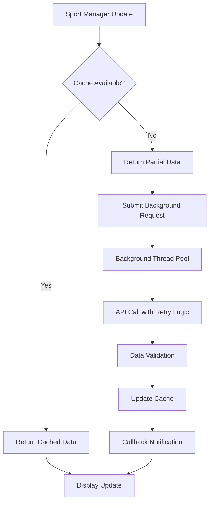

# Background Service Guide

## Overview

The Background Service is a high-performance threading system that prevents the main display loop from blocking during data fetching operations. This feature significantly improves responsiveness and user experience by offloading heavy API calls to background threads.

## How It Works

### Core Architecture

The Background Service uses a **ThreadPoolExecutor** to manage concurrent data fetching operations:

```
┌─────────────────┐    ┌──────────────────┐    ┌─────────────────┐
│   Main Display  │    │  Background      │    │   API Endpoints │
│      Loop       │◄──►│   Service        │◄──►│   (ESPN, etc.)  │
│                 │    │                  │    │                 │
│ • Non-blocking  │    │ • Thread Pool    │    │ • Season Data   │
│ • Responsive    │    │ • Request Queue  │    │ • Live Scores   │
│ • Fast Updates  │    │ • Caching        │    │ • Standings     │
└─────────────────┘    └──────────────────┘    └─────────────────┘
```

### Key Components

#### 1. BackgroundDataService Class
- **Location**: `src/background_data_service.py`
- **Purpose**: Manages the thread pool and request queuing
- **Features**:
  - Configurable worker threads (default: 3)
  - Request timeout handling (default: 30 seconds)
  - Automatic retry logic (default: 3 attempts)
  - Result caching and validation

#### 2. Sport Manager Integration
Each sport manager (NFL, NBA, NHL, etc.) includes:
- Background service initialization
- Request tracking and management
- Graceful fallback to synchronous fetching
- Comprehensive logging

#### 3. Configuration System
- Per-sport configuration options
- Enable/disable functionality
- Customizable worker counts and timeouts
- Priority-based request handling

## Configuration

### Basic Setup

Add background service configuration to any sport manager in `config.json`:

```json
{
  "nfl_scoreboard": {
    "enabled": true,
    "background_service": {
      "enabled": true,
      "max_workers": 3,
      "request_timeout": 30,
      "max_retries": 3,
      "priority": 2
    }
  }
}
```

### Configuration Options

| Option | Type | Default | Description |
|--------|------|---------|-------------|
| `enabled` | boolean | `true` | Enable/disable background service |
| `max_workers` | integer | `3` | Number of background threads |
| `request_timeout` | integer | `30` | Timeout in seconds for API requests |
| `max_retries` | integer | `3` | Number of retry attempts on failure |
| `priority` | integer | `2` | Request priority (1=highest, 5=lowest) |

### Supported Sport Managers

All major sport managers support background service:

- **NFL Manager** - Professional football
- **NCAAFB Manager** - College football
- **NBA Manager** - Professional basketball
- **NHL Manager** - Professional hockey
- **MLB Manager** - Professional baseball
- **MiLB Manager** - Minor league baseball
- **Soccer Manager** - Multiple soccer leagues
- **Leaderboard Manager** - Multi-sport standings
- **Odds Ticker Manager** - Live betting odds

## How Data Fetching Works

### Traditional (Synchronous) Approach
```
1. Display loop requests data
2. API call blocks for 5-10 seconds
3. Display freezes during fetch
4. Data returned and displayed
5. Repeat process
```

### Background Service Approach
```
1. Display loop requests data
2. Check cache for existing data
3. Return cached data immediately (if available)
4. Submit background fetch request
5. Background thread fetches fresh data
6. Cache updated for next request
7. Display remains responsive throughout
```

### Request Flow



## Performance Benefits

### Before Background Service
- **Display blocking**: 5-10 seconds during data fetch
- **Poor user experience**: Frozen display during updates
- **Limited responsiveness**: Only one API call at a time
- **Cache misses**: No fallback for failed requests

### After Background Service
- **Non-blocking**: Display remains responsive
- **Immediate response**: Cached data returned instantly
- **Concurrent fetching**: Multiple API calls simultaneously
- **Graceful degradation**: Fallback to partial data
- **Better caching**: Intelligent cache management

## Error Handling

### Robust Error Management
The background service includes comprehensive error handling:

1. **API Failures**: Automatic retry with exponential backoff
2. **Timeout Handling**: Configurable request timeouts
3. **Data Validation**: Ensures API responses are properly formatted
4. **Fallback Mechanisms**: Graceful degradation when services fail
5. **Logging**: Detailed logging for debugging and monitoring

### Error Recovery
```python
# Example error handling in background service
try:
    response = requests.get(url, timeout=timeout)
    data = response.json()
    
    # Validate data structure
    if not isinstance(data, dict) or 'events' not in data:
        raise ValueError("Invalid API response format")
        
except requests.Timeout:
    logger.warning(f"Request timeout for {url}")
    # Retry with exponential backoff
    
except requests.RequestException as e:
    logger.error(f"Request failed: {e}")
    # Fall back to cached data
```

## Monitoring and Debugging

### Logging
The background service provides detailed logging:

```
13:22:13.614 - INFO:src.background_data_service:[NFL] Background service enabled with 3 workers
13:22:13.615 - INFO:src.background_data_service:[NFL] Submitting background fetch request
13:22:13.616 - INFO:src.background_data_service:[NFL] Background fetch completed successfully
13:22:13.617 - INFO:src.background_data_service:[NFL] Cache updated with fresh data
```

### Performance Metrics
Monitor these key metrics:
- **Request completion time**: How long API calls take
- **Cache hit rate**: Percentage of requests served from cache
- **Error rate**: Frequency of failed requests
- **Worker utilization**: How efficiently threads are used

## Best Practices

### Configuration Recommendations

1. **Worker Count**: Start with 3 workers, adjust based on system performance
2. **Timeout Settings**: Use 30 seconds for most APIs, adjust for slow endpoints
3. **Retry Logic**: 3 retries with exponential backoff works well
4. **Priority Levels**: Use priority 1 for live games, priority 3 for historical data

### Performance Optimization

1. **Enable for All Sports**: Use background service for all sport managers
2. **Monitor Cache Usage**: Ensure cache is being utilized effectively
3. **Adjust Workers**: Increase workers for systems with good network performance
4. **Use Appropriate Timeouts**: Balance between responsiveness and reliability

### Troubleshooting

#### Common Issues

1. **High Memory Usage**: Reduce `max_workers` if system is memory-constrained
2. **Slow Performance**: Increase `max_workers` for better concurrency
3. **API Rate Limits**: Increase `request_timeout` and reduce `max_workers`
4. **Cache Issues**: Check cache directory permissions and disk space

#### Debug Mode
Enable debug logging to troubleshoot issues:

```json
{
  "logging": {
    "level": "DEBUG"
  }
}
```

## Advanced Features

### Priority-Based Queuing
Requests can be prioritized based on importance:
- **Priority 1**: Live games (highest priority)
- **Priority 2**: Recent games
- **Priority 3**: Upcoming games
- **Priority 4**: Historical data
- **Priority 5**: Standings and statistics

### Dynamic Worker Scaling
The system can automatically adjust worker count based on:
- System load
- Network performance
- API response times
- Error rates

### Intelligent Caching
Advanced caching strategies:
- **TTL-based expiration**: Data expires after configurable time
- **Smart invalidation**: Cache invalidated when new data available
- **Partial data caching**: Store incomplete data for immediate display
- **Compression**: Compress cached data to save disk space

## Migration Guide

### Enabling Background Service

1. **Update Configuration**: Add background service config to sport managers
2. **Test Individual Sports**: Enable one sport at a time
3. **Monitor Performance**: Check logs and system performance
4. **Enable All Sports**: Once tested, enable for all sport managers

### Example Migration

```json
// Before
{
  "nfl_scoreboard": {
    "enabled": true,
    "update_interval_seconds": 3600
  }
}

// After
{
  "nfl_scoreboard": {
    "enabled": true,
    "update_interval_seconds": 3600,
    "background_service": {
      "enabled": true,
      "max_workers": 3,
      "request_timeout": 30,
      "max_retries": 3,
      "priority": 2
    }
  }
}
```

## Future Enhancements

### Planned Features
- **Priority-based request queuing**: Intelligent request prioritization
- **Dynamic worker scaling**: Automatic worker count adjustment
- **Performance analytics dashboard**: Real-time performance monitoring
- **Advanced caching strategies**: More sophisticated cache management
- **API rate limit handling**: Intelligent rate limit management

### Contributing
To contribute to the background service:
1. Fork the repository
2. Create a feature branch
3. Implement your changes
4. Add tests and documentation
5. Submit a pull request

## Conclusion

The Background Service represents a significant improvement in LEDMatrix performance and user experience. By offloading data fetching to background threads, the display remains responsive while ensuring fresh data is always available.

For questions or issues, please refer to the troubleshooting section or create an issue in the GitHub repository.
